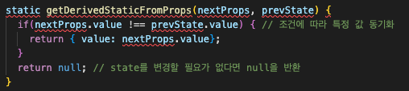
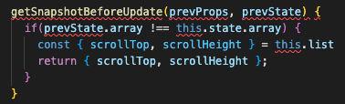
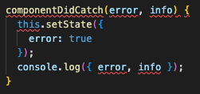

# 리액트를 다루는 기술 정리

## 컴포넌트란?

리액트에서 앱을 이루는 최소한의 단위
각 부분을 재사용 가능한 조각으로 UI를 나눈 것과 같다.

## props와 state의 차이:

props는 외부(부모 컴포넌트)에서 상속받는 데이터이며, 데이터 변경 불가능(읽기전용?)
state는 내부(컴포넌트)에서 생성하고 활동하며 데이터 변경가능

### constructor 없이 state의 초깃값 지정 가능

# setState 시용법
this.setState((prevState, props) => {
    return {
        // 업데이트하고 싶은 내용, props는 필요하지 않다면 생략 가능
    }
})

this.setState(prevState => {
    return {
        // 업데이트 하고 싶은 내용, props를 생략한 형태
    }
})

### 화살표 함수에서 값을 바로 반환하고 싶으면 { }를 생략해도 된다
ex) const sum = (a, b) => a + b;

## this.setState가 끝난 후 특정 작업 실행하기
this.setState(
    {
        // 업데이트 하고 싶은 내용
        number: number + 1
    },
    () => {
        // setState가 끝난 후 작업 하고 싶은 내용
        console.log('방금 setState가 호출되었습니다.');
        console.log(this.state);
    }
}

# useState 사용법
const [현재상태, 상태를 바꾸어 주는 함수(세터 함수)] = useState(디폴트값);

### useState는 한 컴포넌트에서 여러 번 사용가능하다.

# state를 사용할 때 주의사항
state의 값을 변경할 때에는 setState나 useState를 통해 전달받은 세터 함수를 사용해야 한다.
ex) 잘못된 예시
// 클래스형 컴포넌트에서...
this.state.number = this.state.number + 1;
this.state.array = this.array.push(2);
this.state.object.value = 5;

// 함수 컨포넌트에서...
const [object, setObject] = useState({a: 1, b: 1});
object.b = 2;

### 배열이나 객체를 업데이트해야 할 때는 배열이나 객체의 사본을 만들고 그 사본에 값을 업데이트한 후, 그 사본의 상태를 setState 혹은 세터 함수를 통해 업데이트한다.
ex) 사본을 만들어 업데이트하는 예시
// 객체 다루기
const object = { a: 1, b: 2, c: 3};
const nextObject = { ...object, b: 2}; // 사본을 만들어서 b 값만 덮어 쓰기

// 배열 다루기
const array = [
    { id: 1, value: true},
    { id: 2, value: true},
    { id: 3, vlaue: false}
];
let nextArray = array.concat({ id: 4}); // 새 항목 추가
nextArray.filter(item => item.id !== 2); // id가 2인 항목 제거
nextArray.map(item => (item.id === 1 ? { ...item, value: false } : item)); // id가 1인 항목의 value를 false로 설정

# 배열의 map() 함수

## 문법
arr.map(callback, [thisArg])
* callback: 새로운 배열의 요소를 생성하는 함수로 파라미터는 다음 세가지이다.
 - currentValue: 현재 처리하고 있는 요소
 - index: 현재 처리하고 있는 요소의 index 값
 - array: 현재 처리하고 있는 원본 배열
* thisArg(선택 항목): callback 함수 내부에서 사용할 this 레퍼런스

ex) const names = ['눈사람', '얼음', '눈', '바람'];
    const nameList = names.map(name => <li>{name}</li>);
    return <ul>{nameList}</ul>;

# 7장 리액트 컴포넌트의 라이프 사이클
리액트의 컴포넌트에는 라이프 사이클(수명주기)이 존재한다.
컴포넌트의 수명은 페이지에 렌더링되기 전인 준비 과정에서 시작하여 페이지에서 사라질 때 끝난다.
라이프 사이클 메서드는 클래스형 컴포넌트에서만 사용할 수 있다.
함수형 컴포넌트는 Hooks 기능을 사용하여 비슷한 작업을 처리할 수 있다.

## 7.1) 라이프사이클 메서드의 이해
라이프 사이클 메서드의 종류는 총 아홉 가지.
Will 접두사가 붙은 메서드는 어떤 작업을 작동하기 전에 실행
Did 접두사가 붙은 메서드는 어떤 작업을 작동한 후에 실행
이 메서드들은 우리가 컴포넌트 클래스에서 덮어 써 선언함으로써 사용가능

라이프사이클은 총 세 가지 마운트, 업데이트, 언마운트 카테고리로 나눔

### 마운트
DOM이 생성되고 웹 브라우저 상에 나타나는 것을 마운트라고 함
이때 호출하는 메서드는 다음과 같음
#### 마운트할 때 호출하는 메서드:
컴포넌트 만들기 -> constructor -> getDerivedStateFromPros -> render -> componentDidMount

- constructor: 컴포넌트를 새로 만들 때 마다 호출되는 클래스 생성자 메서드

- getDerivedStateFromProps: props에 있는 값을 state에 넣을 때 사용하는 메서드

- render: 우리가 준비한 UI를 렌더링하는 메서드

- componentDidMount: 컴포넌트가 웹 브라우저상에 나타난 후 호출하는 메서드

### 업데이트
컴포넌트는 다음과 같은 총 네 가지 경우에 업데이트한다.
##### 1. props가 바뀔 때
##### 2. state가 바뀔 때
##### 3. 부모 컴포넌트가 리렌더링될 때
##### 4. this.forceUpdate로 강제로 렌더링을 트리거할 때
이렇게 컴포넌트를 업데이트할 때는 다음 메서드를 호출
#### 업데이트할 때 호출하는 메서드
업데이트를 발생시키는 요인(props 변경, state 변경, 부모 컴포넌트 리렌더링) ->
getDerivedStateFromProps -> shouldComponentUpdate
-true 반환시 render 호출, false 반환 시 여기서 작업 취소> render
-> getSnapshotBeforeUpdate -웹 브라우저상의 실제 DOM 변화>
componentDidUpdate

#### 컴포넌트의 업데이트 이유

##### 첫째, 부모 컴포넌트에서 넘겨주는 props가 바뀔 때

컴포넌트에 전달하는 props의 값이 바뀌면 컴포넌트 렌더링이 이루어짐

##### 둘째, 컴포넌트 자신이 들고 있는 state가 setState를 통해 업데이트될 때

##### 셋째, 부모 컴포넌트가 리렌더링될 때

자신에게 할당된 props가 바뀌지 않아도, 또는 자신이 들고 있는 state가 바뀌지 않아도,

부모 컴포넌트가 리렌더링되면 자식 컴포넌트 또한 리렌더링 됨

- getDerivedStateFromProps: 이 메서드는 마운트 과정에서도 호출되며, 업데이트가 시작하기 전에도 호출됨. props의 변화에 따라 state값에도 변화를 주고 싶을 때 사용
- shouldComponentUpdate: 컴포넌트가 리렌더링을 해야 할지 말아야 할지를 결정하는 메서드. 이 메서드에서는 true 혹은 false 값을 반환해야 하며, true를 반환하면 다음 라이프사이클 메서드를 계속 실행하고, false를 반환하면 작업을 중지. 즉, 리렌더링되지 않음. 만약 특정 함수에서 this.forceUpdate() 함수를 호출한다면 이 과정을 생략하고 바로 render 함수를 호출
- render: 컴포넌트를 리렌더링
- getSnapshotBeforeUpdate: 컴포넌트 변화를 DOM에 반영하기 바로 직전에 호출하는 메서드
- componentDidUpdate: 컴포넌트의 업데이트 작업이 끝난 후 호출하는 메서드

### 언마운트

마운트의 반대 과정, 즉 컴포는트를 DOM에서 제거하는 것을 언마운트라고 한다.

#### 언마운트할 때 호출하는 메서드

언마운트하기 -> componentWillUnmount

- componentWillUnmount: 컴포넌트가 웹 브라우저상에서 사라지기 전에 호출하는 메서드

### 

## 7.2) 라이프사이클 메서드 살펴보기

### 7.2.1) render() 함수

#### render() { ... }

- 이 메서드는 컴포넌트의 모양새를 정의

- **라이프사이클 메서드 중 유일한 필수 메서드 **

- 이 메서드 안에서 this.props와 this.state에 접근할 수 있으며, 리액트 요소를 반환

- 요소는 div같은 태그가 될 수 있고, 따로 선언한 컴포넌트가 될 수도 있다.

- 아무것도 보여 주고 싶지 않다면 null 값이나 false 값을 반환
- 주의사항
  - 이 메서드 안에서는 이벤트 설정이 아닌 곳에서 setState를 사용하면 안되며, 브라우저의 DOM에 접근해서도 안 됨
  - DOM 정보를 가져오거나 state에 변화를 줄 때는 componentDidMount에서 처리해야 함

### 7.2.2) constructor 메서드

#### constructor(props) { ... }

- 컴포넌트의 생성자 메서드로 컴포넌트를 만들 때 처음으로 실행됨
- 이 메서드에서는  초기 state를 정할 수 있음

### 7.2.3) getDerivedStateFromProps 메서드

- 리액트 v16.3 이후에 새로 만든 라이프사이클 메서드
- props로 받아 온 값을 state에 동기화시키는 용도로 사용하며, 컴포넌트가 마운트될 때와 업데이트될 때 호출
- 

### 7.2.4) componentDidMount 메서드

#### componentDidMount() { ... }

- 컴포넌트를 만들고, 첫 렌더링을 다 마친 후 실행
- 이 안에서 다른 자바스크립트 라이브러리 또는 프레임워크의 함수를 호출하거나 이벤트 등록, setTimeout, setInterval, 네트 워크 요청 같은 비동기 작업을 처리

### 7.2.5) shouldComponentUpdate 메서드

#### shouldComponentUpdate(nextProps, nextState) { ... }

- props 또는 state를 변경했을 때, 리렌더링을 시작할지 여부를 지정하는 메서드
- 이 메서드에서는 반드시 true 값 또는 false 값을 반환해야 함
- 컴포넌트를 만들 때 이 메서드를 따로 생성하지 않으면 기본적으로 true 값을 반환
- 이 메서드가 false 값을 반환한다면 업데이트 과정은 여기서 중지
- 이 메서드 안에서 현재 props와 state는 this.props와 this.state로 접근하고, 새로 설정될 props 또는 state는 nextProps와 nextState로 접근할 수 있음
- 프로젝트 성능을 최적화할 때, 상황에 맞는 알고리즘을 작성하여 리렌더링을 방지할 때는 false 값을 반환하게 함

### 7.2.6) getSnapshotBeforeUpdate 메서드

- 리액트 v16.3 이후 만든 메서드

- 이 메서드는 render에서 만들어진 결과물이 브라우저에 실제로 반영되기 직전에 호출

- 이 메서드에서 반환하는 값은 componentDidUpdate에서 세 번째 파라미터인 snapshot 값으로 전달받을 수 있는데, 주로 업데이트하기 직전의 값을 참고할 일이 있을 때 활용 (예: 스크롤바 위치 유지)

- 

  

### 7.2.7) componentDidUpdate 메서드

#### componentDidUpdate(prevProps, prevState, snapshot) { ... }

- 이것은 리렌더링을 완료한 후 실행
- 업데이트가 끝난 직후이므로, DOM 관련 처리를 해도 무방
- prevProps 또는 prevState를 사용하여 컴포넌트가 이전에 가졌던 데이터에 접근 가능
- 또 getSnapshotBeforeUpdate에서 반환한 값이 있다면 여기서 snapshot 값을 전달받을 수 있음

### 7.2.8) componentWillUnmount 메서드

#### componentWillUnmount() { ... }

- 이것은 컴포넌트를 DOM에서 제거할 때 실행
- ComponentDidMount에서 등록한 이벤트, 타이머, 직접 생성한 DOM이 있다면 여기서 제거 작업을 해야함

### 7.2.9) componentDidCatch 메서드

- componentDidCatch 메서드는 리액트 v16에서 새롭게 도입됨
- 컴포넌트 렌더링 도중에 에러가 발생했을 때 애플리켕션이 먹통이 되지 않고 오류 UI를 보여 줄 수 있게 해줌
- 사용방법: 
- 여기서는 error는 파라미터에 어떤 에러가 발생했는지 알려주며, info 파라미터는 어디에 있는 코드에서 오류가 발생했는지에 대한 정보를 줌
- 앞의 코드에서는 그저 console.log만 했지만, 나중에 실제로 사용할 때 오류가 발생하면 서버 API를 호출하여 따로 수집할 수도 있음
- 그러나 이 메서드를 사용할 때는 컴포넌트 자신에게 발생하는 에러를 잡아낼 수 없고 자신의 this.props.children으로 전달되는 컴포넌트에서 발생하는 에러만 잡아낼 수 있다.

## 

